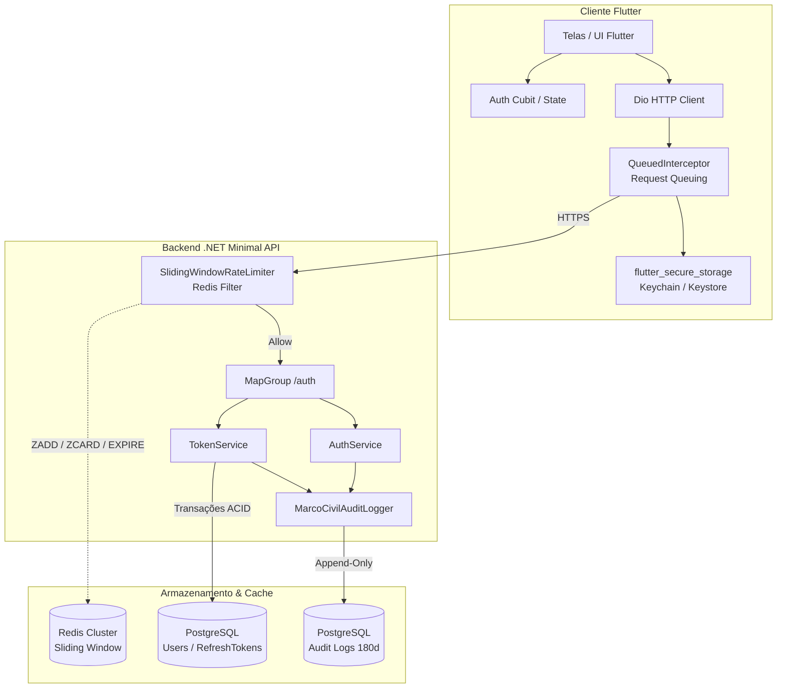
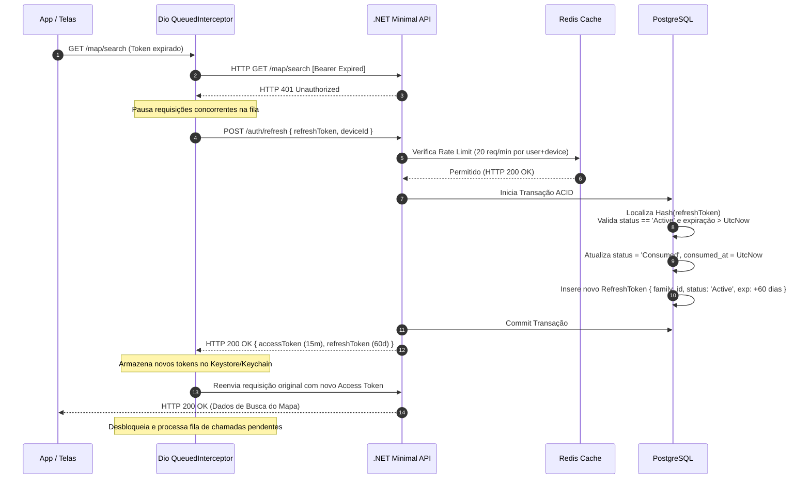
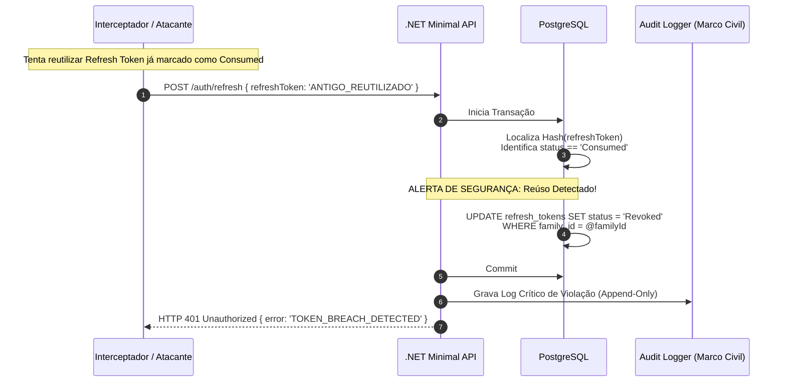
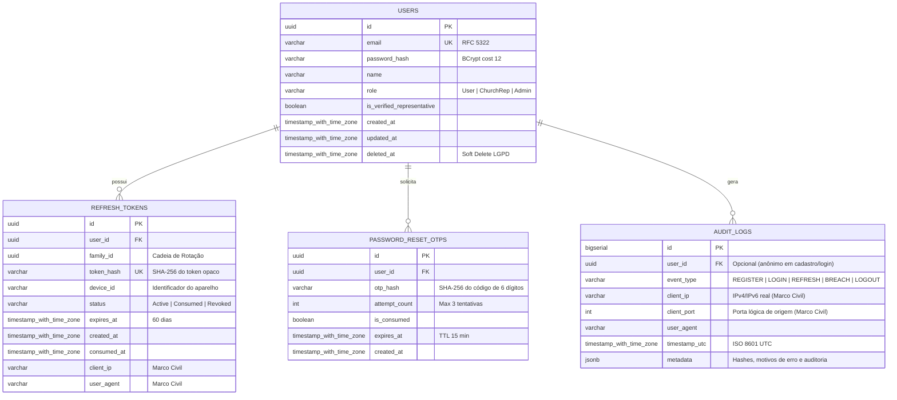

# Design: Autenticação, Autorização e Sessão Contínua

**Spec**: [`.specs/features/authentication-authorization/spec.md`](spec.md)  
**Status**: Approved  
**Stack**: Backend em C# (.NET 8/9 Minimal APIs) + Cliente Móvel em Flutter (Dart)  
**Decisões Vinculadas**: [`AD-006`](../../STATE.md#L12), [`AD-007`](../../STATE.md#L13), [`AD-008`](../../STATE.md#L14), [`AD-009`](../../STATE.md#L15), [`AD-010`](../../STATE.md#L16), [`AD-011`](../../STATE.md#L17), [`AD-014`](../../STATE.md#L20), [`AD-024`](../../STATE.md#L30)

---

## 1. Visão Geral da Arquitetura

O sistema implementa uma camada de autenticação híbrida: **stateless** para consumo de APIs protegidas (via JWT assinado assimetricamente ou via HMAC-SHA256 com validade de 15 minutos) e **stateful** para a governança de sessões móveis resilientes (via pares de tokens com Rotação Automática de Refresh Token - RTR, expiração deslizante de 60 dias e detecção automática de violação por família de tokens no PostgreSQL).

A contenção de força bruta e abusos opera na borda do backend através de um filtro de endpoint em C# acoplado ao **Redis** executando o algoritmo **Sliding Window Counter** em scripts Lua atômicos. No cliente Flutter, a biblioteca de rede HTTP opera com **enfileiramento de requisições concorrentes (*request queuing*)** e persistência estrita no hardware criptográfico seguro do sistema operacional (iOS Keychain e Android Keystore).



---

## 2. Padrões de Projeto e Reutilização

### 2.1 Backend C# (.NET 8/9)

* **Organização**: Monólito Modular estruturado em fatias verticais (*Vertical Slice*) para o módulo `Auth`, isolando Endpoints, DTOs, Handlers e Entidades.
* **Bibliotecas e Frameworks Utilizados**:
  * `Microsoft.AspNetCore.Authentication.JwtBearer`: Validação nativa e de alta performance de tokens JWT no pipeline do ASP.NET Core.
  * `System.IdentityModel.Tokens.Jwt`: Emissão, assinatura e serialização de claims (`sub`, `jti`, `exp`, `iat`, `family_id`).
  * `StackExchange.Redis`: Conexão multiplexada resiliente para execução de scripts Lua atômicos de rate limiting.
  * `Npgsql.EntityFrameworkCore.PostgreSQL`: Mapeamento ORM e migrações para PostgreSQL.
  * `BCrypt.Net-Next`: Hashing seguro de senhas com fator de custo (*work factor*) calibrado em 12.
  * `FluentValidation`: Validação declarativa desacoplada de DTOs de entrada.

### 2.2 Cliente Mobile (Flutter)

* **Bibliotecas Selecionadas**:
  * `dio`: Cliente HTTP robusto com suporte nativo a `QueuedInterceptor`, permitindo pausar requisições concorrentes durante a renovação silenciosa de token `401 Unauthorized` e reenviá-las sequencialmente sem falhas de corrida.
  * `flutter_secure_storage`: Wrapper para iOS Keychain (com atributo `kSecAttrAccessibleAfterFirstUnlockThisDeviceOnly`) e Android Keystore (`EncryptedSharedPreferences`).
  * `flutter_bloc`: Gerenciamento determinístico de estado de autenticação (`AuthInitial`, `Unauthenticated`, `Authenticating`, `Authenticated`).

---

## 3. Diagramas de Sequência

### 3.1 Renovação Silenciosa (Silent Refresh) com Request Queuing e RTR



### 3.2 Detecção Automática de Violação (Breach Detection)



---

## 4. Componentes e Contratos Técnicos

### 4.1 Endpoints .NET Minimal API

```csharp
public static class AuthEndpoints
{
    public static RouteGroupBuilder MapAuthEndpoints(this RouteGroupBuilder group)
    {
        group.MapPost("/register", RegisterAsync)
             .AddEndpointFilter<RateLimitFilter>("register")
             .Produces<AuthResponse>(StatusCodes.Status201Created)
             .Produces<ValidationProblemDetails>(StatusCodes.Status400BadRequest)
             .Produces(StatusCodes.Status429TooManyRequests);

        group.MapPost("/login", LoginAsync)
             .AddEndpointFilter<RateLimitFilter>("login")
             .Produces<AuthResponse>(StatusCodes.Status200OK)
             .Produces(StatusCodes.Status401Unauthorized)
             .Produces(StatusCodes.Status429TooManyRequests);

        group.MapPost("/refresh", RefreshTokenAsync)
             .AddEndpointFilter<RateLimitFilter>("refresh")
             .Produces<AuthResponse>(StatusCodes.Status200OK)
             .Produces(StatusCodes.Status401Unauthorized);

        group.MapPost("/logout", LogoutAsync)
             .RequireAuthorization()
             .Produces(StatusCodes.Status204NoContent);

        group.MapPost("/forgot-password", ForgotPasswordAsync)
             .AddEndpointFilter<RateLimitFilter>("forgot-password")
             .Produces(StatusCodes.Status200OK);

        group.MapPost("/reset-password", ResetPasswordAsync)
             .AddEndpointFilter<RateLimitFilter>("reset-password")
             .Produces(StatusCodes.Status200OK)
             .Produces(StatusCodes.Status400BadRequest);

        group.MapGet("/me", GetCurrentUserAsync)
             .RequireAuthorization()
             .Produces<UserSummaryResponse>(StatusCodes.Status200OK);

        return group;
    }
}
```

### 4.2 Interfaces de Serviços C#

```csharp
public interface IAuthService
{
    Task<Result<AuthResponse>> RegisterAsync(RegisterRequest request, ClientConnectionContext context);
    Task<Result<AuthResponse>> LoginAsync(LoginRequest request, ClientConnectionContext context);
    Task<Result<AuthResponse>> RefreshTokenAsync(RefreshTokenRequest request, ClientConnectionContext context);
    Task<Result> LogoutAsync(Guid userId, string? refreshToken, ClientConnectionContext context);
    Task<Result> RequestPasswordResetOtpAsync(ForgotPasswordRequest request, ClientConnectionContext context);
    Task<Result> ResetPasswordWithOtpAsync(ResetPasswordRequest request, ClientConnectionContext context);
}

public interface ITokenService
{
    string GenerateAccessToken(User user, Guid familyId);
    (string rawToken, string tokenHash) GenerateRefreshToken();
    ClaimsPrincipal? GetPrincipalFromExpiredToken(string token);
}

public interface IRateLimiterService
{
    Task<RateLimitCheckResult> CheckRateLimitAsync(string routeKey, string identifier, int limit, TimeSpan window);
}

public interface IAuditLogService
{
    Task LogEventAsync(string eventType, Guid? userId, ClientConnectionContext context, object? metadata);
}
```

### 4.3 Script Lua no Redis para Sliding Window Counter

Para garantir atomicidade total sem *race conditions*, o rate limit executa o seguinte script Lua no Redis:

```lua
-- KEYS[1]: Chave do contador (ex: "rl:login:ip:192.168.1.1")
-- ARGV[1]: Timestamp UTC atual em milissegundos
-- ARGV[2]: Janela de tempo em milissegundos (ex: 900000 para 15 min)
-- ARGV[3]: Limite máximo permitido na janela
-- ARGV[4]: Identificador único da requisição (ex: UUID)

local key = KEYS[1]
local now = tonumber(ARGV[1])
local window = tonumber(ARGV[2])
local limit = tonumber(ARGV[3])
local memberId = ARGV[4]
local clearBefore = now - window

-- 1. Remove entradas fora da janela deslizante
redis.call('ZREMRANGEBYSCORE', key, '-inf', clearBefore)

-- 2. Conta requisições ativas na janela
local currentRequests = redis.call('ZCARD', key)

if currentRequests < limit then
    -- 3. Adiciona requisição atual com score = timestamp
    redis.call('ZADD', key, now, memberId)
    -- Define TTL para expirar a chave após o fim da janela
    redis.call('PEXPIRE', key, window)
    return { 1, limit - currentRequests - 1, 0 } -- { Permitido, Restantes, RetryAfterSegundos }
else
    -- Limite excedido: calcula tempo para desocupar o item mais antigo
    local oldest = redis.call('ZRANGE', key, 0, 0, 'WITHSCORES')
    local retryAfter = 0
    if #oldest > 0 then
        retryAfter = math.ceil((tonumber(oldest[2]) + window - now) / 1000)
        if retryAfter < 1 then retryAfter = 1 end
    end
    return { 0, 0, retryAfter } -- { Bloqueado, Restantes, RetryAfterSegundos }
end
```

---

## 5. Modelagem de Dados (PostgreSQL)



---

## 6. Arquitetura do Cliente Flutter

### 6.1 Interceptor com Enfileiramento de Requisições (`QueuedInterceptor`)

```dart
class AuthInterceptor extends QueuedInterceptor {
  final Dio dio;
  final SecureStorageService storage;
  final VoidCallback onSessionExpired;

  AuthInterceptor({
    required this.dio,
    required this.storage,
    required this.onSessionExpired,
  });

  @override
  Future<void> onRequest(
    RequestOptions options,
    RequestInterceptorHandler handler,
  ) async {
    final accessToken = await storage.getAccessToken();
    if (accessToken != null && accessToken.isNotEmpty) {
      options.headers['Authorization'] = 'Bearer $accessToken';
    }
    return handler.next(options);
  }

  @override
  Future<void> onError(
    DioException err,
    ErrorInterceptorHandler handler,
  ) async {
    // Intercepta 401 Unauthorized para renovação silenciosa
    if (err.response?.statusCode == 401 && !err.requestOptions.path.contains('/auth/')) {
      final refreshToken = await storage.getRefreshToken();
      final deviceId = await storage.getDeviceId();

      if (refreshToken == null) {
        onSessionExpired();
        return handler.reject(err);
      }

      try {
        // Chamada direta via instância limpa de Dio sem interceptor recursivo
        final refreshResponse = await Dio(BaseOptions(baseUrl: dio.options.baseUrl)).post(
          '/auth/refresh',
          data: {
            'refreshToken': refreshToken,
            'deviceId': deviceId,
          },
        );

        final newAccessToken = refreshResponse.data['accessToken'];
        final newRefreshToken = refreshResponse.data['refreshToken'];

        await storage.saveTokens(
          accessToken: newAccessToken,
          refreshToken: newRefreshToken,
        );

        // Reexecuta a requisição original pausada com o novo token
        final retryOptions = err.requestOptions;
        retryOptions.headers['Authorization'] = 'Bearer $newAccessToken';
        
        final retryResponse = await dio.fetch(retryOptions);
        return handler.resolve(retryResponse);
      } on DioException catch (refreshErr) {
        // Falha no refresh (token expirado ou violação detectada)
        await storage.clearTokens();
        onSessionExpired();
        return handler.reject(refreshErr);
      }
    }

    return handler.next(err);
  }
}
```

---

## 7. Estratégia de Tratamento de Erros

| Cenário de Erro | Código HTTP | Código Interno / Payload | Comportamento no Cliente Flutter |
| :--- | :---: | :--- | :--- |
| **Credenciais incorretas** | 401 | `CREDENCIAIS_INVALIDAS` | Mensagem amigável de erro na tela de login; preserva o e-mail digitado. |
| **Token expirado (Access Token)** | 401 | `TOKEN_EXPIRADO` | Transparente para o usuário; `QueuedInterceptor` executa *silent refresh*. |
| **Reúso de Token (Breach Detected)** | 401 | `TOKEN_BREACH_DETECTED` | Sessão revogada; limpa armazenamento seguro e redireciona para a tela de login com alerta de segurança. |
| **Acesso a perfil alheio** | 403 | `ACESSO_NEGADO_PROPRIEDADE` | Exibe diálogo de permissão insuficiente e impede visualização de dados privados. |
| **Alteração de igreja sem status Verified** | 403 | `REPRESENTANTE_NAO_VERIFICADO` | Exibe tela de orientação para início do fluxo de reivindicação (`church-profile-claim`). |
| **Limite de taxa excedido (Rate Limit)** | 429 | `LIMITE_REQUISICOES_EXCEDIDO` | Lê o cabeçalho `Retry-After`, bloqueia temporariamente o botão e exibe contador regressivo em segundos para o usuário. |
| **Código OTP inválido / expirado** | 400 | `OTP_INVALIDO_OU_EXPIRADO` | Exibe tentativas restantes (máx. 3); se excedido, orienta solicitar novo código. |
| **Cluster Redis indisponível** | 200/401 | *(Fail-Open Controlado)* | A API processa a autenticação normalmente, gravando log crítico de alerta no sistema para intervenção DevOps. |

---

## 8. Riscos, Preocupações e Mitigações

| Preocupação / Risco | Localização / Componente | Impacto | Mitigação no Design |
| :--- | :--- | :--- | :--- |
| **Condição de Corrida em Concorrência Móvel** | App Flutter / `Dio` Interceptor | Várias requisições disparadas simultâneas podem chamar `/auth/refresh` concorrentemente, causando detecção de falso reúso. | Adotado o `QueuedInterceptor` no Flutter (pausa em fila atômica) + janela de tolerância de 2 segundos no backend para mesma requisição em trânsito com mesmo IP e `device_id`. |
| **Spoofing de IP em Rate Limiting** | Backend / `RateLimitFilter.cs` | Atacante forja o header `X-Forwarded-For` para burlar limites de taxa ou causar negação de serviço em IPs alheios. | Configuração estrita de `ForwardedHeadersOptions` no ASP.NET Core aceitando apenas proxies reversos conhecidos (API Gateway / Cloudflare). |
| **Corrupção de Keystore em Dispositivos Android Antigos** | Flutter / `flutter_secure_storage` | Exceções de hardware podem impedir leitura de tokens após atualização de SO. | Tratamento defensivo no service local: se a chave criptográfica falhar, limpa o estado com segurança e solicita login novo sem travar o app. |
| **Gargalo no Redis em Horário de Pico** | Backend / `RedisConnectionMultiplexer` | Sobrecarga de chamadas em `CheckRateLimitAsync`. | Conexão multiplexada única do `StackExchange.Redis` com pool compartilhado e fail-open com log crítico caso haja timeout de socket. |

---

## 9. Decisões Técnicas Consolidadas

| Decisão | Escolha Adotada | Justificativa |
| :--- | :--- | :--- |
| **Algoritmo de Hash de Senha** | `BCrypt` com Work Factor 12 | Padrão da indústria com alta resistência a ataques por força bruta acelerada via GPU, sem lentidão perceptível no cadastro. |
| **Algoritmo de Rate Limiting** | *Sliding Window Counter* com Sorted Set (`ZSET`) no Redis | Elimina o "efeito de rajada" na borda dos minutos (*burst traffic* do Fixed Window), garantindo contagem contínua real. |
| **Auditoria do Marco Civil** | Tabela particionada `audit_logs` no PostgreSQL (Append-Only) | Garante integridade e retenção imutável por 180 dias com expiração automatizada para conformidade estrita com LGPD e Marco Civil. |
| **Interceptor HTTP no Cliente** | `Dio.QueuedInterceptor` | Bloqueia nativamente chamadas HTTP em trânsito enquanto a tarefa assíncrona de refresh é executada, evitando race conditions. |
