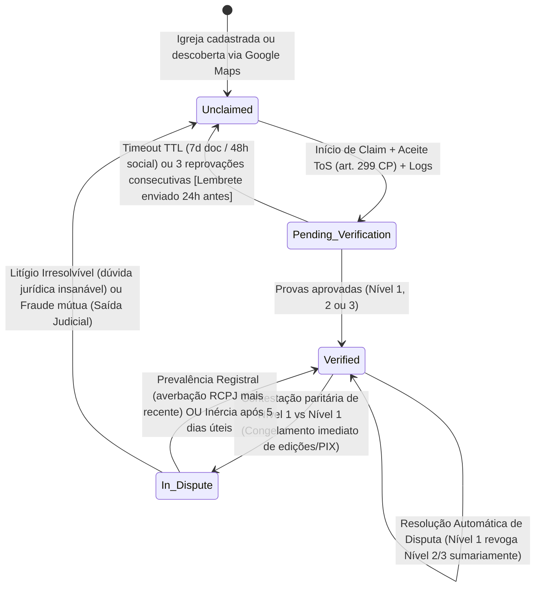
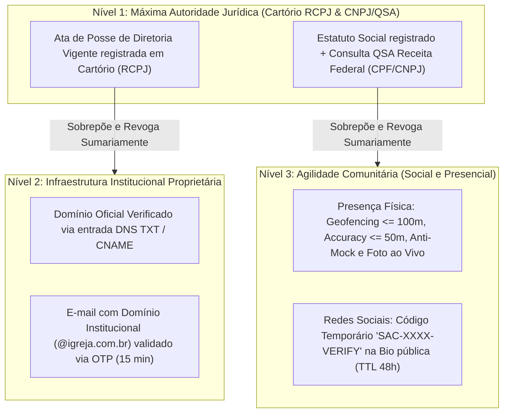
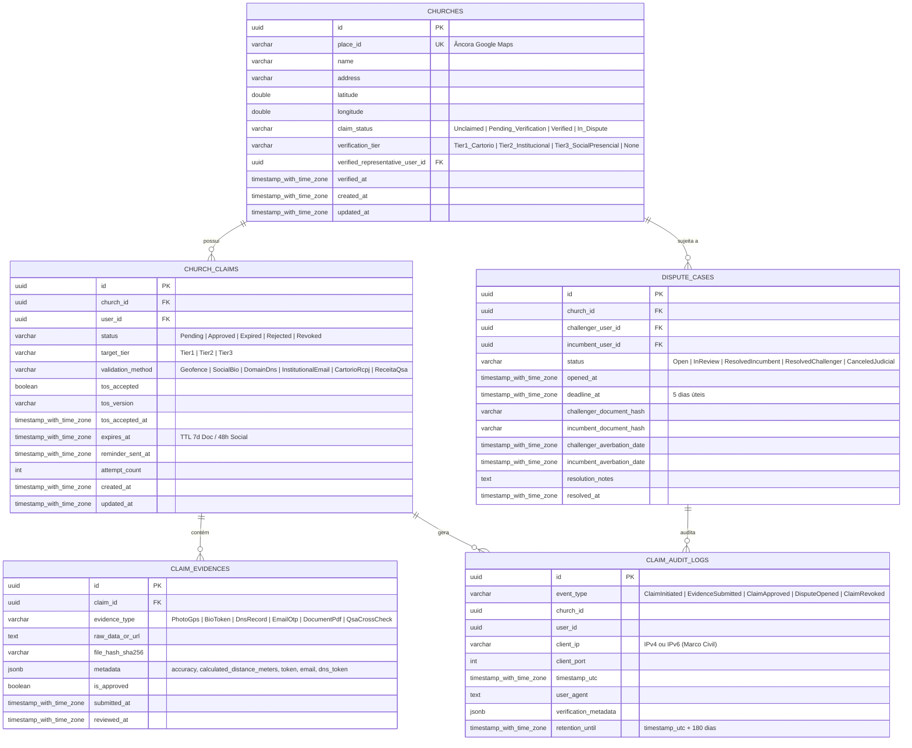

# Design Arquitetural: Reivindicação de Perfil de Igreja (church-profile-claim)

**Feature**: Reivindicação de Perfil de Igreja (Claim)  
**Spec**: [`.specs/features/church-profile-claim/spec.md`](spec.md)  
**Status**: Ready for Execution  
**Diagrama de Arquitetura Interativo**: [`.archify/architecture-church-profile-claim-20261007-214500/church-profile-claim.html`](../../.archify/architecture-church-profile-claim-20261007-214500/church-profile-claim.html)  
**Decisões Arquiteturais Vinculadas**: `AD-004`, `AD-005`, `AD-009`, `AD-012`, `AD-013`, `AD-014`, `AD-015`, `AD-016`, `AD-017`, `AD-025`.

---

## 1. Visão Geral e Contexto do Sistema

A funcionalidade **`church-profile-claim`** é o elo fundamental que transforma templos externos ou cadastrados sem gestão (`Unclaimed`) em perfis comunitários oficiais e autenticados (`Verified`). A experiência conecta-se diretamente à ação *"Reivindicar esta igreja"* da tela interativa de mapa (`maps-integration` / `ChurchMapBottomSheet`), permitindo que pastores e líderes assumam a gestão legítima da sua igreja a partir do contexto físico e geográfico (`place_id`, nome, endereço e coordenadas).

### 1.1 Objetivos de Arquitetura
1. **Segurança Jurídica & Compliance**: Aceite mandatório de Termos de Uso com declaração formal de legitimidade sob as penas do art. 299 do Código Penal (Falsidade Ideológica), enquadramento como Provedora de Aplicação de Internet (Lei nº 12.965/2014 - Marco Civil da Internet), cláusula de mera intermediária técnica nos fluxos simplificados e mecanismo ativo de *Notice and Takedown* como condição funcional de isenção civil (`AD-005`, `AD-013`).
2. **Trilha de Auditoria Imutável (Marco Civil art. 15 & LGPD)**: Coleta e armazenamento *append-only* de `client_ip`, `client_port`, `timestamp_utc`, `user_agent` e `verification_metadata` em repositório dedicado com retenção mínima obrigatória de 180 dias (6 meses) e rotina automatizada de expiração/anonimização pós-prazo (`AD-014`).
3. **Hierarquia Probatória Estrita em 3 Níveis**:
   - **Nível 1 (Máxima Autoridade / Cartório RCPJ & CNPJ/QSA)**: Libera plenos poderes, incluindo gestão de chaves PIX/doações, gestão de administradores e alterações cadastrais críticas.
   - **Nível 2 (Canais Institucionais Proprietários: Domínio TXT/CNAME ou E-mail com OTP)**: Permissões operacionais de publicação.
   - **Nível 3 (Validações Sociais e Presenciais: Geofencing <= 100m + Foto ao vivo, ou Código na Bio com TTL 48h)**: Permissões operacionais básicas de divulgação comunitária.
4. **Governança de Disputas & Resolução Automática**:
   - Documento de Nível 1 revoga sumariamente qualquer vínculo anterior de Nível 2 ou 3 sem conceder direito a bloqueio unilateral pelo titular anterior (`AD-012`).
   - Disputa paritária entre dois detentores de Nível 1 congela o perfil em `In_Dispute` (mantendo dados visíveis no mapa/busca e bloqueando edições/PIX) por 5 dias úteis para apresentação de Certidão atualizada do RCPJ (`AD-016`).
5. **Timeouts / TTLs Diferenciados e Liberação Automática**: Reivindicações pendentes sem envio de provas expiram em 7 dias (fluxo documental) ou 48 horas (fluxo social), com lembrete preventivo disparado 24 horas antes e transição automática `Pending_Verification` $\rightarrow$ `Unclaimed` (`AD-015`).

---

## 2. Diagrama de Arquitetura de Componentes

O fluxo arquitetural interativo validado no Archify reflete a integração ponta a ponta entre o aplicativo Flutter e a API .NET 9:

```
[Flutter App / UI & Câmera] ──(Bearer JWT)──> [JwtBearer Filter & RateLimit]
            │                                             │
      (ToS / Provas)                             (/claim/initiate & verify/*)
            ▼                                             ▼
     [ClaimCubit / State] ───────────────────> [Minimal API Endpoints]
                                                          │
                   ┌──────────────────────────────────────┼──────────────────────────────────────┐
                   ▼                                      ▼                                      ▼
      [ClaimOrchestratorService]                [GeofencingService]                   [DisputeResolutionEngine]
                   │                             (Haversine <= 100m)                  (Prevalência N1 & RCPJ 5d)
                   ├───────────────┐                      │                                      │
                   ▼               ▼                      │                                      ▼
           [PostgreSQL DB]   [Redis Cache/Lock]           │                             [External Cartórios/QSA]
         (churches & claims)   (Tokens Bio 48h)           │                                (Receita / RCPJ)
                   ▲                                      │
                   │                                      │
       [ClaimTtlBackgroundService] ───────────────────────┼─────────────────────────────> [AuditLogService]
          (Worker TTL 7d/48h)                                                              (Append-Only 180d)
```

---

## 3. Máquina de Estados e Ciclo de Vida do Perfil

A congregação religiosa transita estritamente entre quatro estados bem definidos:



### 3.1 Tabela de Transições e Regras de Negócio

| Estado Origem | Evento Disparador | Estado Destino | Pré-condições / Ações de Efeito |
| :--- | :--- | :--- | :--- |
| `Unclaimed` | `InitiateClaim` | `Pending_Verification` | Usuário autenticado; Aceite de ToS art. 299 CP gravado em `claim_audit_logs`; Lock distribuído no Redis. |
| `Pending_Verification` | `ApproveEvidence` | `Verified` | Prova atende critérios do Nível solicitado; concede permissões correspondentes; atualiza selo público. |
| `Pending_Verification` | `ExpireClaim` | `Unclaimed` | Decorrido TTL (7 dias documental / 48h social) sem envio de evidências; revoga permissões de rascunho; libera perfil. |
| `Verified` (Nível 2/3) | `ContestTier1` | `Verified` (Nível 1) | Contestante anexa Ata RCPJ / QSA válida; revogação sumária do vínculo anterior; notificação sem bloqueio unilateral. |
| `Verified` (Nível 1) | `ContestParity` | `In_Dispute` | Segundo requerente apresenta documento de Nível 1; bloqueio imediato de edições/PIX; abre prazo de 5 dias úteis. |
| `In_Dispute` | `ResolveDispute` | `Verified` (Nível 1) | Averbação mais recente no RCPJ confirmada OU desclassificação da outra parte por decurso do prazo de 5 dias úteis. |
| `In_Dispute` | `CancelDispute` | `Unclaimed` | Moderação constata litígio irresolvível judicialmente; anula reivindicações; orienta ação perante o Judiciário. |

---

## 4. Hierarquia Probatória e Matriz de Permissões

### 4.1 Níveis de Validação



### 4.2 Matriz de Autorização por Tier

| Recurso / Ação no Perfil | `Unclaimed` | `Pending` (Rascunho) | `Verified` Nível 3 (Social/GPS) | `Verified` Nível 2 (Domínio/Email) | `Verified` Nível 1 (Cartório/QSA) | `In_Dispute` (Litígio) |
| :--- | :---: | :---: | :---: | :---: | :---: | :---: |
| Consulta pública no mapa/busca | Sim | Sim | Sim | Sim | Sim | Sim |
| Editar horários de cultos e reuniões | ❌ | Rascunho | ✅ Publicação | ✅ Publicação | ✅ Publicação | ❌ Congelado |
| Editar fotos, descrição e contatos | ❌ | Rascunho | ✅ Publicação | ✅ Publicação | ✅ Publicação | ❌ Congelado |
| Cadastrar/alterar chave PIX e doações | ❌ | ❌ | ❌ **(Exige Nível 1)** | ❌ **(Exige Nível 1)** | ✅ **Permitido** | ❌ Congelado |
| Gerenciar outros administradores | ❌ | ❌ | ❌ | ✅ Operacional | ✅ Total | ❌ Congelado |
| Alterar CNPJ / Razão Social | ❌ | ❌ | ❌ | ❌ | ✅ Revalidação | ❌ Congelado |
| Selo público no aplicativo | Nenhum | *"Em verificação"* | *"Verificação da Comunidade"* | *"Verificação Institucional"* | *"Igreja Verificada Oficial"* | *"Em revisão de titularidade"* |
| Transferir titularidade | ❌ | ❌ | ❌ | ❌ | ✅ Permitido | ❌ Congelado |

---

## 5. Modelagem de Dados no PostgreSQL (EF Core)



### 5.1 Índices Estratégicos e Particionamento
- `CREATE INDEX ix_church_claims_active ON church_claims(church_id, status) WHERE status = 'Pending';`
- `CREATE INDEX ix_church_claims_ttl ON church_claims(expires_at) WHERE status = 'Pending';`
- `CREATE INDEX ix_dispute_cases_deadline ON dispute_cases(deadline_at) WHERE status = 'Open';`
- `CREATE INDEX ix_claim_audit_logs_retention ON claim_audit_logs(retention_until);`
- Tabela `claim_audit_logs` opera em padrão **Append-Only** (permissão de `SELECT` e `INSERT` apenas, sem permissão de `UPDATE` ou `DELETE` no banco de dados para a aplicação).

---

## 6. Endpoints .NET 9 Minimal API (`/claim/*`)

Todos os endpoints são agrupados sob `/claim` e exigem autenticação Bearer JWT (`RequireAuthorization()`).

```csharp
public static class ClaimEndpoints
{
    public static RouteGroupBuilder MapClaimEndpoints(this RouteGroupBuilder group)
    {
        // 1. Inicia o processo de claim com aceite do ToS art. 299 CP
        group.MapPost("/initiate", InitiateClaimAsync)
             .RequireAuthorization()
             .Produces<InitiateClaimResponse>(StatusCodes.Status200OK)
             .Produces(StatusCodes.Status400BadRequest)
             .Produces(StatusCodes.Status409Conflict) // Igreja já reivindicada ou claim pendente
             .WithName("InitiateClaim")
             .WithSummary("Inicia reivindicação com aceite obrigatório de ToS e registro de auditoria Marco Civil");

        // 2. Validação Nível 3 - Presença Física (Geofencing + Foto ao vivo)
        group.MapPost("/verify/geofence", VerifyGeofenceAsync)
             .RequireAuthorization()
             .DisableAntiforgery() // Suporte a multipart/form-data
             .Produces<VerificationResultResponse>(StatusCodes.Status200OK)
             .Produces(StatusCodes.Status400BadRequest)
             .WithName("VerifyGeofence")
             .WithSummary("Valida presença física por Haversine server-side (raio <= 100m, accuracy <= 50m) e foto ao vivo");

        // 3. Validação Nível 3 - Redes Sociais (Gera código de bio ou valida presença na bio)
        group.MapPost("/verify/social-bio/generate", GenerateSocialTokenAsync)
             .RequireAuthorization()
             .Produces<SocialTokenResponse>(StatusCodes.Status200OK)
             .WithName("GenerateSocialToken")
             .WithSummary("Gera token temporário SAC-XXXX-VERIFY com validade de 48 horas");

        group.MapPost("/verify/social-bio/confirm", ConfirmSocialBioAsync)
             .RequireAuthorization()
             .Produces<VerificationResultResponse>(StatusCodes.Status200OK)
             .Produces(StatusCodes.Status400BadRequest)
             .WithName("ConfirmSocialBio")
             .WithSummary("Verifica a presença do token na bio da conta oficial da congregação");

        // 4. Validação Nível 2 - Domínio Institucional (E-mail OTP ou DNS TXT)
        group.MapPost("/verify/domain/send-otp", SendDomainEmailOtpAsync)
             .RequireAuthorization()
             .Produces(StatusCodes.Status200OK)
             .Produces(StatusCodes.Status400BadRequest)
             .WithName("SendDomainEmailOtp")
             .WithSummary("Envia código OTP para endereço de e-mail com domínio próprio da congregação");

        group.MapPost("/verify/domain/confirm-otp", ConfirmDomainEmailOtpAsync)
             .RequireAuthorization()
             .Produces<VerificationResultResponse>(StatusCodes.Status200OK)
             .Produces(StatusCodes.Status400BadRequest)
             .WithName("ConfirmDomainEmailOtp")
             .WithSummary("Confirma código OTP de 6 dígitos em domínio institucional");

        // 5. Validação Nível 1 - Cartório RCPJ e Consulta QSA (Receita Federal)
        group.MapPost("/verify/document/rcpj", SubmitCartorioDocumentAsync)
             .RequireAuthorization()
             .DisableAntiforgery()
             .Produces<VerificationResultResponse>(StatusCodes.Status200OK)
             .Produces(StatusCodes.Status400BadRequest)
             .WithName("SubmitCartorioDocument")
             .WithSummary("Submete Ata de Posse registrada em RCPJ e Estatuto Social para validação de Nível 1");

        group.MapPost("/verify/document/qsa", VerifyQsaAsync)
             .RequireAuthorization()
             .Produces<VerificationResultResponse>(StatusCodes.Status200OK)
             .Produces(StatusCodes.Status400BadRequest)
             .WithName("VerifyQsa")
             .WithSummary("Valida representação legal via cruzamento de CPF do solicitante com QSA da Receita Federal");

        // 6. Contestações e Resolução de Disputas
        group.MapPost("/dispute/contest", OpenDisputeAsync)
             .RequireAuthorization()
             .Produces<DisputeContestResponse>(StatusCodes.Status200OK)
             .Produces(StatusCodes.Status400BadRequest)
             .WithName("OpenDispute")
             .WithSummary("Abre contestação pública contra perfil; aplica sobreposição sumária N1 ou congela em In_Dispute");

        group.MapPost("/dispute/{disputeId}/submit-certificate", SubmitDisputeCertificateAsync)
             .RequireAuthorization()
             .Produces(StatusCodes.Status200OK)
             .Produces(StatusCodes.Status400BadRequest)
             .WithName("SubmitDisputeCertificate")
             .WithSummary("Submete Certidão de Breve Relato do RCPJ durante a janela de 5 dias úteis de In_Dispute");

        // 7. Consulta de Status e Permissões
        group.MapGet("/status/{churchId:guid}", GetClaimStatusAsync)
             .RequireAuthorization()
             .Produces<ChurchClaimStatusResponse>(StatusCodes.Status200OK)
             .Produces(StatusCodes.Status404NotFound)
             .WithName("GetClaimStatus")
             .WithSummary("Consulta estado do ciclo de vida, permissões ativas e histórico de reivindicação");

        return group;
    }
}
```

---

## 7. Interfaces e Contratos dos Serviços de Domínio

### 7.1 DTOs e Requisições

```csharp
public record InitiateClaimRequest(
    Guid ChurchId,
    string? PlaceId,
    bool AcceptTosArt299Cp,
    bool AcceptTechnicalIntermediaryClause,
    string TosVersion,
    ValidationMethod PreferredMethod
);

public record InitiateClaimResponse(
    Guid ClaimId,
    Guid ChurchId,
    string Status,
    DateTime ExpiresAtUtc,
    string Instructions
);

public record GeofenceVerificationRequest(
    Guid ClaimId,
    double Latitude,
    double Longitude,
    double AccuracyMeters,
    bool IsMockLocationDetected
);

public record VerificationResultResponse(
    Guid ClaimId,
    bool IsApproved,
    string CurrentStatus,
    string GrantedTier,
    string? ErrorCode,
    string? Message
);

public record DisputeContestRequest(
    Guid ChurchId,
    string ChallengerName,
    string ChallengerCpf,
    string ChallengerPhone,
    bool AcceptTosArt299Cp,
    string DocumentHashSha256,
    DateTime AverbationDateUtc
);

public record DisputeContestResponse(
    Guid DisputeId,
    string ActionTaken, // "AutomaticOverrideTier1" ou "EnteredInDispute"
    string ChurchStatus,
    DateTime? DeadlineAtUtc,
    string Message
);
```

### 7.2 Interfaces de Serviços Core

```csharp
public interface IClaimOrchestratorService
{
    Task<Result<InitiateClaimResponse>> InitiateClaimAsync(
        InitiateClaimRequest request,
        ClientConnectionMetadata connectionMeta,
        Guid currentUserId,
        CancellationToken ct = default);

    Task<Result<VerificationResultResponse>> CompleteVerificationAsync(
        Guid claimId,
        ClaimTier tier,
        string evidenceType,
        object evidenceData,
        ClientConnectionMetadata connectionMeta,
        CancellationToken ct = default);

    Task<ChurchClaimStatusResponse> GetStatusAsync(Guid churchId, Guid currentUserId, CancellationToken ct = default);
}

public interface IGeofencingService
{
    double CalculateHaversineDistanceMeters(double lat1, double lon1, double lat2, double lon2);
    
    Result<bool> ValidatePresence(
        double churchLat,
        double churchLng,
        double deviceLat,
        double deviceLng,
        double horizontalAccuracyMeters,
        bool isMockLocation);
}

public interface IDisputeResolutionEngine
{
    Task<Result<DisputeContestResponse>> ProcessContestAsync(
        DisputeContestRequest request,
        ClientConnectionMetadata connectionMeta,
        Guid challengerUserId,
        CancellationToken ct = default);

    Task<Result> ResolveParityDisputeAsync(Guid disputeId, CancellationToken ct = default);
}

public interface IAuditLogService
{
    Task RecordEventAsync(
        string eventType,
        Guid churchId,
        Guid? userId,
        ClientConnectionMetadata connection,
        object metadata,
        CancellationToken ct = default);
}

public record ClientConnectionMetadata(
    string ClientIp,
    int ClientPort,
    string UserAgent,
    DateTime TimestampUtc
);
```

---

## 8. Algoritmos e Detalhes de Implementação

### 8.1 Cálculo Seguro de Geofencing Server-Side (Haversine)
A verificação de presença física executa a fórmula geodésica estritamente no backend em `GeofencingService`:

$$\Delta \sigma = 2 \cdot \arcsin \left( \sqrt{\sin^2\left(\frac{\Delta \phi}{2}\right) + \cos(\phi_1) \cdot \cos(\phi_2) \cdot \sin^2\left(\frac{\Delta \lambda}{2}\right)} \right)$$
$$d = R \cdot \Delta \sigma \quad (\text{com } R = 6.371.000 \text{ metros})$$

- Se `isMockLocation == true`: rejeita sumariamente com código `LOCALIZACAO_SIMULADA_DETECTADA`.
- Se `horizontalAccuracyMeters > 50.0`: rejeita com código `PRECISAO_GPS_INSUFICIENTE`.
- Se $d > 100.0$ metros: rejeita com código `FORA_DO_RAIO_PERMITIDO`.
- Se $d \le 100.0$ metros e precisão $\le 50.0$m: aceita coordenadas e valida presença física com sucesso.

### 8.2 Auditoria de Conexão (Marco Civil art. 15)
O `AuditLogService` extrai de forma transparente o IP real do cliente via cabeçalho `X-Forwarded-For` ou socket direto, sanitiza a porta TCP e grava no banco relacional `claim_audit_logs` com TTL de retenção de 180 dias (`retention_until = DateTime.UtcNow.AddDays(180)`).

### 8.3 Resolução Automática vs Conflito Paritário
1. Se congregação estiver em `Verified` com Tier 2 ou Tier 3:
   - A submissão de contestação com documento de Nível 1 dispara **Resolução Automática**: revoga o vínculo de Nível 2 ou 3 no mesmo instante, associa o representante de Nível 1 com `Verified` e notifica o detentor anterior por prevalência legal documental.
2. Se congregação estiver em `Verified` com Tier 1:
   - Nova contestação documental com mandato concorrente transita a igreja para `In_Dispute`.
   - Congela imediatamente edições de perfil e bloqueia chaves PIX.
   - Dispara timer de **5 dias úteis** no PostgreSQL para anexação de Certidão de Breve Relato/Inteiro Teor do RCPJ.
   - Resolução: prevalece a certidão com averbação mais recente no RCPJ. Se uma parte permanecer inerte após os 5 dias úteis, é desclassificada por inércia processual. Persistindo litígio insolúvel, reverte a `Unclaimed` para resolução em juízo.

### 8.4 Worker em Background para Timeouts e Lembretes
O `ClaimTtlBackgroundService` roda como `IHostedService` a cada 30 minutos:
1. Localiza claims pendentes com `expires_at <= DateTime.UtcNow`:
   - Executa transição `Pending_Verification` $\rightarrow$ `Unclaimed`.
   - Limpa dados não verificados e libera o perfil para novas reivindicações.
2. Localiza claims pendentes onde `expires_at <= DateTime.UtcNow.AddHours(24)` e `reminder_sent_at IS NULL`:
   - Envia e-mail e push de alerta *"Restam 24 horas para enviar suas evidências de reivindicação"*.
   - Marca `reminder_sent_at = DateTime.UtcNow`.

---

## 9. Arquitetura do Cliente Flutter

### 9.1 Telas e Fluxo do Usuário
1. **`ClaimInitiationScreen`** (`frontend/lib/features/claim/presentation/screens/claim_initiation_screen.dart`):
   - Recebe dados pré-preenchidos do mapa via rota `/claim` (`placeId`, `name`, `address`, `latitude`, `longitude`).
   - Apresenta os Termos de Uso (ToS), caixa de seleção do art. 299 CP e cláusula de intermediária técnica.
   - Bloqueia o botão *"Avançar"* até que ambos os termos sejam assinalados.
2. **`ClaimMethodSelectionScreen`** (`frontend/lib/features/claim/presentation/screens/claim_method_selection_screen.dart`):
   - Apresenta os 3 níveis probatórios com clareza dos poderes concedidos:
     - Nível 1: Cartório / QSA (Selo Oficial + Chave PIX liberada).
     - Nível 2: Domínio Próprio / E-mail institucional com OTP.
     - Nível 3: Presença no Templo (Geofencing + Câmera) ou Redes Sociais (Bio).
3. **`ClaimGeofenceCameraScreen`** (`frontend/lib/features/claim/presentation/screens/claim_geofence_camera_screen.dart`):
   - Valida GPS via `GeolocationService` e verifica APIs anti-mock location nativas.
   - Habilita câmera ao vivo integrada para captura da fachada ou altar (bloqueado upload da galeria).
4. **`ClaimDisputeScreen`** (`frontend/lib/features/claim/presentation/screens/claim_dispute_screen.dart`):
   - Formulário público *"Contestar Propriedade desta Igreja"*.
   - Upload de documento comprobatório de Nível 1 e acompanhamento do status do contraditório (janela de 5 dias úteis).

### 9.2 Gerenciamento de Estado (`ClaimCubit`)
- `ClaimInitial`: Estado neutro com dados pré-preenchidos.
- `ClaimSubmitting`: Indicador de carregamento e envio de multipart/ToS.
- `ClaimInitiated`: Claim iniciado com sucesso e contagem regressiva de TTL (7d ou 48h).
- `ClaimVerifiedSuccess`: Notificação de aprovação com nível concedido (`tier`) e selo ativado.
- `ClaimDisputed`: Tela de aviso de perfil congelado em `In_Dispute` com prazo de 5 dias úteis.
- `ClaimError`: Mensagens padronizadas com tratamento explícito de erros (`FORA_DO_RAIO_PERMITIDO`, `PRECISAO_GPS_INSUFICIENTE`, `LOCALIZACAO_SIMULADA_DETECTADA`).

---

## 10. Matriz de Rastreabilidade de Requisitos

| Requisito | História / Critério de Aceite | Componente Backend | Componente Flutter |
| :--- | :--- | :--- | :--- |
| **CLAIM-01** | Máquina de Estados (`Unclaimed`, `Pending`, `Verified`, `In_Dispute`) | `ClaimOrchestratorService`, `ChurchClaim` | `ClaimCubit`, `ClaimState` |
| **CLAIM-02** | Validação Presença Física (Geofence 100m, Acc $\le$ 50m, Anti-Mock, Haversine) | `GeofencingService`, `VerifyGeofenceAsync` | `ClaimGeofenceCameraScreen` |
| **CLAIM-03** | Validação Redes Sociais (Token Bio `SAC-XXXX-VERIFY`, TTL 48h) | `ConfirmSocialBioAsync`, Redis Cache | `ClaimSocialBioWidget` |
| **CLAIM-04** | Validação Canais Institucionais (Domínio TXT, E-mail OTP 15 min) | `SendDomainEmailOtpAsync`, `ConfirmDomainEmailOtpAsync` | `ClaimEmailOtpWidget` |
| **CLAIM-05** | Validação Cartorial e QSA (Ata RCPJ, Estatuto, Receita Federal QSA) | `SubmitCartorioDocumentAsync`, `VerifyQsaAsync` | `ClaimDocumentUploadWidget` |
| **CLAIM-06** | Termos de Uso, art. 299 CP, Enquadramento Provedora e Takedown | `InitiateClaimAsync`, validação de request | `ClaimInitiationScreen` (Checkboxes) |
| **CLAIM-07** | Trilha de Auditoria Append-Only (Marco Civil art. 15, 180 dias) | `AuditLogService`, `claim_audit_logs` | `DioClient` (headers de IP/Device) |
| **CLAIM-08** | Matriz de Permissões por Tier (Nível 1 pleno/PIX vs Nível 2/3 operacional) | Authorization Handler / Policy | `ChurchProfileScreen` (Trava PIX) |
| **CLAIM-09** | Concorrência, Rate Limits (Lockout 72h) e TTLs (7d/48h) + Lembrete 24h | `ClaimTtlBackgroundService`, Redis Lock | `ClaimCubit` (Contador regressivo) |
| **CLAIM-10** | Regra de Resolução Automática de Disputa (Nível 1 sobrepõe Nível 2/3) | `DisputeResolutionEngine.ProcessContestAsync` | `ClaimDisputeScreen` |
| **CLAIM-11** | Contestação Paritária de Nível 1 e Congelamento `In_Dispute` (5 dias úteis) | `DisputeCase`, bloqueio de edições | `ClaimDisputeScreen` (Banner Disputa) |
| **CLAIM-12** | Resolução Paritária (Prevalência Registral RCPJ, Inércia e Saída Judicial) | `DisputeResolutionEngine.ResolveParityDisputeAsync` | `ClaimDisputeScreen` |
