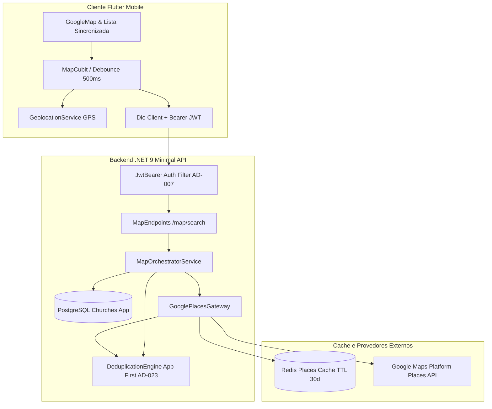
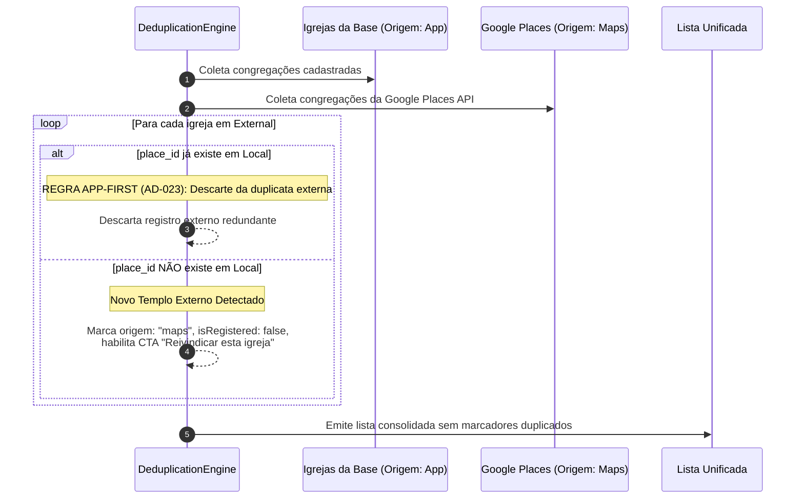
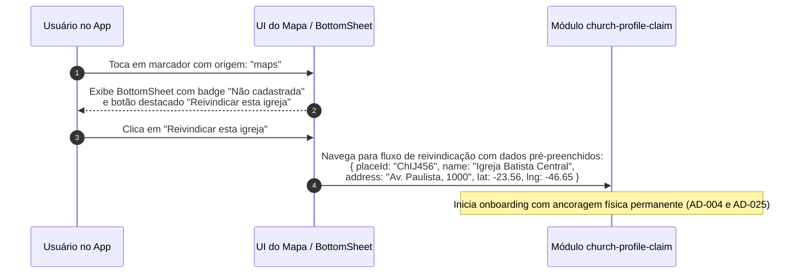
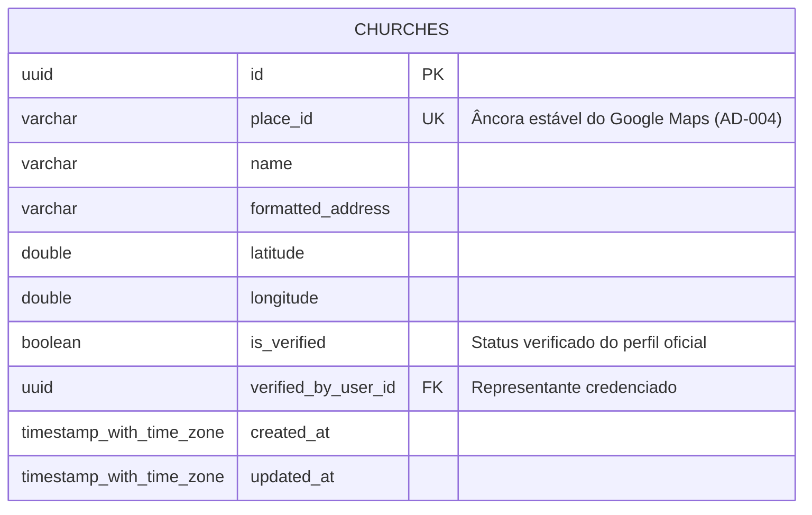

# Design: Integração com Mapas

**Spec**: [`.specs/features/maps-integration/spec.md`](spec.md)  
**Status**: Approved  
**Stack**: Backend em C# (.NET 9 Minimal APIs) + Cliente Móvel em Flutter (Dart) + Google Maps Platform (SDK & Places API) + Redis Cache + PostgreSQL  
**Decisões Vinculadas**: [`AD-004`](../../STATE.md#L10), [`AD-007`](../../STATE.md#L13), [`AD-023`](../../STATE.md#L29), [`AD-025`](../../STATE.md#L31)

---

## 1. Visão Geral da Arquitetura

A funcionalidade de **Integração com Mapas** viabiliza a descoberta georreferenciada de igrejas através de uma experiência híbrida que combina congregações oficialmente cadastradas na plataforma (`origem: app`) com templos físicos catalogados na nuvem da Google Maps Platform (`origem: maps`).

O acesso a todos os recursos de mapa (`GET /map/*`) é estritamente protegido por autenticação JWT (conforme `AD-007` e `AUTH-01`). O sistema é projetado para operar com alta resiliência e controle rigoroso de custos de infraestrutura:
1. **Otimização de Cotas e Caching**: consultas a locais externos utilizam cache distribuído no **Redis com TTL de até 30 dias** (mantendo `place_id` permanente conforme Termos de Serviço da Google Maps Platform) e debounce de 500ms no cliente móvel em eventos de arraste (*pan*) e zoom.
2. **Deduplicação App-First (`AD-023`)**: quando uma igreja externa do Google Maps possui o mesmo `place_id` de uma congregação já homologada na base do aplicativo, o motor de deduplicação prioriza o registro oficial e descarta o item redundante do Google Maps, evitando pinos duplicados.
3. **Ponto de Partida para Reivindicação (`AD-025`)**: igrejas externas não cadastradas são destacadas visualmente no mapa e na lista com o badge "Não cadastrada" e um Call to Action (CTA) "Reivindicar esta igreja", encaminhando o contexto pré-preenchido (`place_id`, coordenadas, nome, endereço) para o módulo `church-profile-claim`.
4. **Degradação Graciosa**: caso a Google Places API sofra indisponibilidade, timeout ou esgotamento de cotas, o backend aciona *fallback gracioso*, mantendo 100% da operação das igrejas cadastradas em `app` com um aviso informativo não bloqueante.

> O diagrama de arquitetura interativo e validado está disponível em:  
> [`.archify/architecture-maps-integration-20261007-144500/maps-integration.html`](file:///C:/DEV/search_a_church/.archify/architecture-maps-integration-20261007-144500/maps-integration.html)



---

## 2. Padrões de Projeto e Reutilização

### 2.1 Backend C# (.NET 9)

* **Organização**: *Vertical Slice Architecture* sob `SearchAChurch.Api.Features.Maps`, desacoplando Endpoints, Handlers, DTOs e Gateways.
* **Padrões de Projeto Adotados**:
  * **Gateway Pattern (`IGooglePlacesGateway`)**: encapsula a comunicação HTTP com a Google Places API e Geocoding, aplicando políticas de resiliência via Polly (retries com jitter, timeout de 3s e circuit breaker).
  * **Cache-Aside Pattern (`IPlacesCacheService`)**: intercepta requisições de locais consultando primeiro o Redis (`places:cache:{place_id}`) antes de onerar a cota externa da Google.
  * **Deduplication Engine (`IDeduplicationEngine`)**: consolida os resultados de duas fontes heterogêneas (`origem: app` e `origem: maps`) utilizando o `place_id` como âncora determinística (`AD-004`), eliminando sobreposições e rotulando itens externos com metadados para reivindicação.
  * **Orquestrador de Descoberta Híbrida (`IMapOrchestratorService`)**: coordena consultas paralelas (busca espacial relacional no PostgreSQL e busca textual/raio na Google Places API) com cancelamento seguro (`CancellationToken`).

### 2.2 Cliente Mobile (Flutter)

* **Bibliotecas Selecionadas**:
  * `google_maps_flutter`: renderização vetorial nativa no Android e iOS, suporte a estilos customizados e controle de câmera.
  * `geolocator`: obtenção das coordenadas geográficas nativas do dispositivo móvel com tratamento defensivo de permissões.
  * `flutter_bloc` (`MapCubit`): gerenciamento reativo e determinístico dos estados do mapa (`MapInitial`, `MapLoading`, `MapLoaded`, `MapError`, `MapDegraded`).
  * `rxdart` ou `Timer`: controle de debounce de 500ms para evitar disparos excessivos de requisições durante arraste e zoom contínuo do usuário.

---

## 3. Diagramas de Sequência

### 3.1 Busca no Mapa com Autenticação JWT, Cache de Places (30d) e Fallback Gracioso

```mermaid
sequenceDiagram
    autonumber
    participant App as App / MapCubit
    participant API as .NET Minimal API
    participant DB as PostgreSQL
    participant Redis as Redis Cache
    participant Google as Google Places API

    App->>API: GET /map/search?lat=-23.55&lng=-46.63&radiusKm=5 [Bearer JWT]
    Note over API: Valida JWT Bearer (RequireAuthorization)
    
    par Consulta Base Local (Origem: App)
        API->>DB: SELECT * FROM churches WHERE ST_DWithin(geom, ...) OR Haversine <= 5km
        DB-->>API: Retorna [Igreja Presbiteriana (place_id: ChIJ123)]
    and Consulta Provedor Externo (Origem: Maps)
        API->>Redis: GET places:cache:query:hash(-23.55,-46.63,5)
        alt Cache Miss no Redis
            API->>Google: GET /maps/api/place/nearbysearch/json (lat, lng, radius)
            alt Sucesso Google API
                Google-->>API: Retorna [ChIJ123 (Duplicata), ChIJ456 (Batista Externa)]
                API->>Redis: SETEX places:cache:... TTL 30 dias
            else Falha / Timeout / Cota Esgotada Google API
                Note over API: Circuit Breaker abre; Degradação Graciosa
                API-->>API: Fallback: Retorna apenas lista local + isDegraded = true
            end
        else Cache Hit no Redis
            Redis-->>API: Retorna dados pré-cacheados (sem custo de cota)
        end
    end

    API->>API: DeduplicationEngine: Remove ChIJ123 da Google (App-First)<br/>Mantém ChIJ123 (app) + ChIJ456 (maps)
    API-->>App: HTTP 200 OK { results: [...], isDegraded: false }
    Note over App: Renderiza Marcadores + Sincroniza Lista e Mapa
```

### 3.2 Deduplicação App-First e Unificação de Marcadores



### 3.3 Ação de Reivindicação de Igreja a partir do Mapa



---

## 4. Componentes e Contratos Técnicos

### 4.1 Endpoints .NET Minimal API

```csharp
public static class MapEndpoints
{
    public static RouteGroupBuilder MapMapEndpoints(this RouteGroupBuilder group)
    {
        group.MapGet("/search", SearchMapAsync)
             .RequireAuthorization()
             .Produces<MapSearchResponse>(StatusCodes.Status200OK)
             .Produces(StatusCodes.Status400BadRequest)
             .Produces(StatusCodes.Status401Unauthorized)
             .WithName("SearchMap")
             .WithSummary("Realiza busca híbrida georreferenciada de igrejas no mapa")
             .WithOpenApi();

        group.MapGet("/places/{placeId}", GetPlaceDetailsAsync)
             .RequireAuthorization()
             .Produces<PlaceDetailsResponse>(StatusCodes.Status200OK)
             .Produces(StatusCodes.Status404NotFound)
             .Produces(StatusCodes.Status401Unauthorized)
             .WithName("GetPlaceDetails")
             .WithSummary("Obtém detalhes de uma igreja externa do Google Places via cache")
             .WithOpenApi();

        group.MapPost("/geocode", GeocodeAddressAsync)
             .RequireAuthorization()
             .Produces<GeocodeResponse>(StatusCodes.Status200OK)
             .Produces(StatusCodes.Status400BadRequest)
             .Produces(StatusCodes.Status404NotFound)
             .Produces(StatusCodes.Status401Unauthorized)
             .WithName("GeocodeAddress")
             .WithSummary("Converte endereço textual em coordenadas geográficas")
             .WithOpenApi();

        return group;
    }
}
```

### 4.2 Interfaces e DTOs em C#

```csharp
public record MapSearchRequest(
    double Latitude,
    double Longitude,
    double RadiusKm = 5.0,
    string? Query = null
);

public enum ChurchSource
{
    App,
    Maps
}

public record ChurchMapItemDto(
    string Id,
    string? PlaceId,
    string Name,
    string Address,
    double Latitude,
    double Longitude,
    double DistanceKm,
    ChurchSource Source,
    bool IsRegistered,
    bool IsVerifiedRepresentative,
    double? RatingAverage,
    int? ReviewCount,
    bool CanClaim
);

public record MapSearchResponse(
    IReadOnlyList<ChurchMapItemDto> Results,
    double CenterLatitude,
    double CenterLongitude,
    double AppliedRadiusKm,
    bool IsDegraded,
    string? DegradedMessage = null
);

public interface IGooglePlacesGateway
{
    Task<Result<IReadOnlyList<GooglePlaceResult>>> SearchNearbyPlacesAsync(
        double latitude,
        double longitude,
        double radiusMeters,
        string? query,
        CancellationToken ct = default);

    Task<Result<GooglePlaceDetails>> GetPlaceDetailsAsync(string placeId, CancellationToken ct = default);
    Task<Result<GeocodeResult>> GeocodeAddressAsync(string address, CancellationToken ct = default);
}

public interface IPlacesCacheService
{
    Task<GooglePlaceDetails?> GetCachedPlaceAsync(string placeId, CancellationToken ct = default);
    Task CachePlaceAsync(string placeId, GooglePlaceDetails details, TimeSpan ttl, CancellationToken ct = default);
}

public interface IDeduplicationEngine
{
    IReadOnlyList<ChurchMapItemDto> Deduplicate(
        IEnumerable<Church> appChurches,
        IEnumerable<GooglePlaceResult> googlePlaces,
        double centerLat,
        double centerLng);
}

public interface IMapOrchestratorService
{
    Task<Result<MapSearchResponse>> SearchAsync(MapSearchRequest request, CancellationToken ct = default);
}
```

---

## 5. Modelagem de Dados e Cache

### 5.1 Entidade no PostgreSQL (`churches`)



* **Índices Críticos**:
  * `CREATE UNIQUE INDEX ix_churches_place_id ON churches(place_id) WHERE place_id IS NOT NULL;`
  * `CREATE INDEX ix_churches_geo_coords ON churches(latitude, longitude);`

### 5.2 Estrutura de Cache no Redis

* **Chave de Detalhes de Local**: `places:details:{place_id}`  
  * **TTL**: 30 dias (`TimeSpan.FromDays(30)`).
  * **Conteúdo**: JSON contendo nome, endereço formatado, telefone, fotos públicas, horários de culto e coordenadas.
* **Chave de Resolução Geográfica**: `geo:address:{sha256(address)}`  
  * **TTL**: 30 dias.
  * **Conteúdo**: Latitude, Longitude e endereço formatado retornado pelo Geocoding.

---

## 6. Arquitetura do Cliente Flutter

### 6.1 Estados e Gerenciamento do Mapa (`MapCubit`)

```dart
abstract class MapState {}

class MapInitial extends MapState {}

class MapLoading extends MapState {
  final double latitude;
  final double longitude;
  MapLoading(this.latitude, this.longitude);
}

class MapLoaded extends MapState {
  final List<ChurchMapItemModel> churches;
  final ChurchMapItemModel? selectedChurch;
  final LatLng center;
  final double radiusKm;
  final bool isDegraded;
  final String? degradedMessage;

  MapLoaded({
    required this.churches,
    this.selectedChurch,
    required this.center,
    required this.radiusKm,
    this.isDegraded = false,
    this.degradedMessage,
  });
}

class MapLocationError extends MapState {
  final String message;
  MapLocationError(this.message);
}
```

### 6.2 Debounce de 500ms e Sincronização Bidirecional

1. **Debounce no Arraste / Zoom**:
   - Cada movimento de câmera no `GoogleMap(onCameraMove: ...)` aciona um cancelador de timer (`_debounceTimer?.cancel()`).
   - Apenas quando a câmera estaciona por mais de **500ms** (`onCameraIdle`), o `MapCubit` despacha a consulta para `GET /map/search`.
2. **Sincronização Bidirecional Lista-Mapa**:
   - Tocar em um marcador no mapa: atualiza `selectedChurch`, rola a lista inferior para o card correspondente e exibe detalhes no BottomSheet.
   - Selecionar item na lista: centraliza a câmera do `GoogleMapController.animateCamera` nas coordenadas da igreja e destaca o marcador.

---

## 7. Estratégia de Tratamento de Erros e Degradação Graciosa

| Cenário de Erro | Resposta / Código | Comportamento da Aplicação |
| :--- | :---: | :--- |
| **API do Google Maps indisponível (5xx/Timeout)** | HTTP 200 (Degradado) | Circuit breaker ativa fallback; retorna apenas congregações locais (`origem: app`) e exibe banner: *"Google Maps temporariamente indisponível. Exibindo igrejas cadastradas."* |
| **Cota da Google Maps excedida (OVER_QUERY_LIMIT)** | HTTP 200 (Degradado) | Utiliza dados do Redis Cache (TTL 30d); caso ausente, aplica degradação graciosa com aviso discreto. |
| **Permissão de GPS negada pelo usuário** | N/A (Client) | Exibe modal explicativo amigável e oferece campo para busca textual (cidade/bairro/endereço) sem crash ou bloqueio do app. |
| **Endereço textual não encontrado no Geocoding** | HTTP 404 / `LOCAL_NAO_ENCONTRADO` | Mensagem amigável: *"Localização não encontrada. Tente buscar pelo nome da cidade ou bairro."* Não renderiza marcadores falsos. |
| **Marcadores sobrepostos no mesmo zoom** | N/A (Client) | Agrupamento dinâmico (*Marker Clustering*); ao clicar no cluster, expande o zoom para separar os pontos. |

---

## 8. Riscos, Preocupações e Mitigações

| Preocupação / Risco | Impacto | Mitigação no Design |
| :--- | :--- | :--- |
| **Explosão de custos de chamadas ao Google Maps** | Fatura elevada de Cloud | Debounce estrito de 500ms no cliente; cache Redis de 30 dias para Place Details e Geocoding; persistência de `place_id` permanente. |
| **Marcadores duplicados para a mesma igreja física** | Confusão do usuário / poluição visual | Motor de Deduplicação App-First (`AD-023`): base oficial sobrepõe e elimina o resultado redundante do Google Maps. |
| **Concorrência de reivindicação (Race Conditions)** | Dois usuários tentando reivindicar a mesma igreja | `place_id` possui índice único no banco relacional; concorrência bloqueada na camada de transação do `church-profile-claim`. |
| **Acesso anônimo consumindo recursos geográficos** | Abuso de infraestrutura | Autenticação via JWT obrigatória em todos os endpoints `/map/*` (`AD-007` e `AUTH-01`). |

---

## 9. Decisões Técnicas Consolidadas

| Decisão | Escolha Adotada | Justificativa |
| :--- | :--- | :--- |
| **Provedor de Mapas** | Google Maps Platform (SDK & Places API) | Cobertura global imbatível de templos e estabelecimentos locais (`AD-025`). |
| **Chave de Unicidade Externa** | `place_id` | Identificador perene mantido e suportado pelos Termos de Serviço da Google Maps Platform (`AD-004`). |
| **Precedência de Exibição** | App-First (`AD-023`) | Preserva as informações ricas oficiais do app, evitando duplicatas com dados brutos da Google. |
| **Política de Cache** | Redis com TTL de até 30 dias | Respeita o limite de armazenamento em cache estipulado pela Google Maps Platform e reduz em mais de 70% o volume de requisições externas. |
