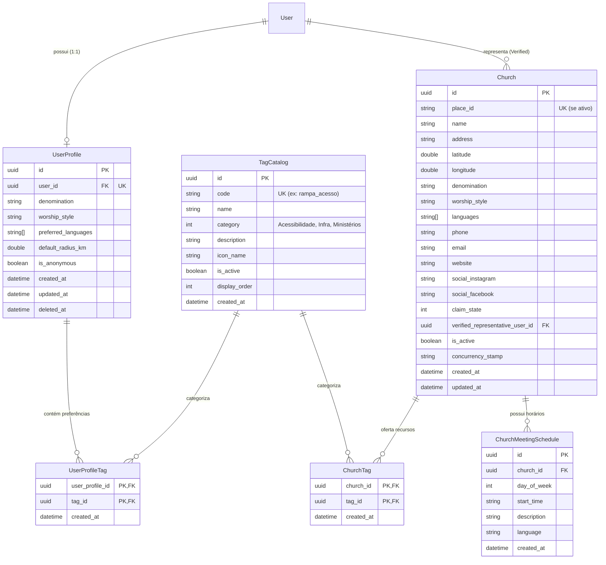
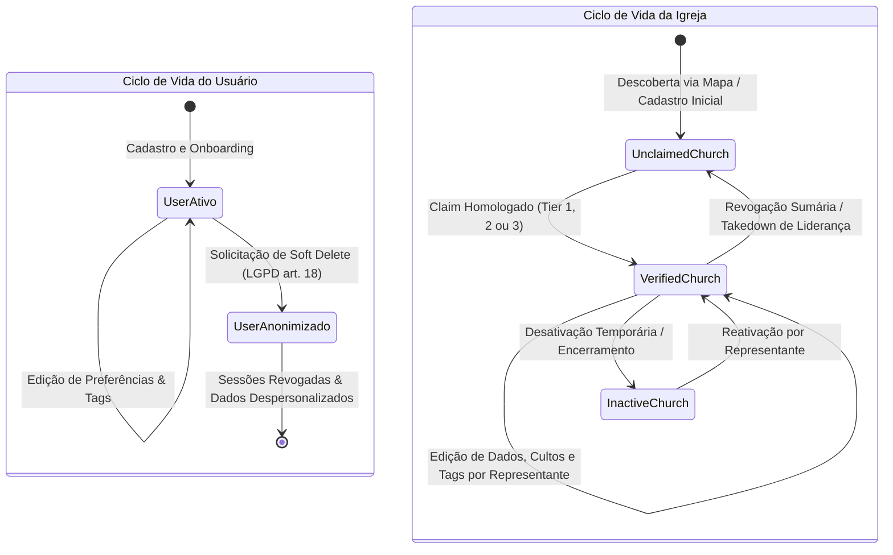

# Design Arquitetural: Gestão de Perfis (profile-management)

**Feature**: Gestão de Perfis (Profile Management)  
**Spec**: [`.specs/features/profile-management/spec.md`](spec.md)  
**Status**: Ready for Planning & Tasks  
**Diagrama de Arquitetura Interativo**: [`.archify/architecture-profile-management-20261008-091000/profile-management.html`](../../.archify/architecture-profile-management-20261008-091000/profile-management.html)  
**Decisões Arquiteturais Vinculadas**: `AD-001`, `AD-004`, `AD-008`, `AD-009`, `AD-020`, `AD-021`, `AD-023`, `AD-025`, `AD-026`.

---

## 1. Visão Geral e Contexto do Sistema

A funcionalidade **`profile-management`** estabelece a espinha dorsal de dados cadastrais e de personalização da plataforma **Search A Church**. Ela é o pilar responsável por alimentar e viabilizar tanto a correspondência multidimensional de relevância (45% de afinidade teológica e litúrgica em `search-discovery`) quanto a manutenção estruturada das informações de congregações homologadas (`church-profile-claim`).

### 1.1 Objetivos de Arquitetura
1. **Preferências Persistentes do Usuário como Baseline**: Permitir que usuários autenticados definam suas preferências de denominação, estilo litúrgico, idiomas, raio de busca padrão (`DefaultRadiusKm`) e tags de necessidades (como acessibilidade e berçário). Essas preferências funcionam como *baseline* automática para buscas futuras (`AD-020`, `AD-021`), enquanto pesquisas efêmeras nunca sobrescrevem o perfil salvo (`AD-026`).
2. **Autorização Estrita Baseada em Propriedade (Ownership)**: Garantir que usuários só possam consultar e alterar seus próprios dados pessoais (`AD-008`). Tentativas de modificar perfis de terceiros são barradas na borda com HTTP 403 `ACESSO_NEGADO_PROPRIEDADE`.
3. **Gestão Eclesiástica Restrita a Representantes Homologados (`Verified`)**: Assegurar que alterações no perfil público da igreja (dados de contato, denominação, cultos, idiomas e infraestrutura) sejam exclusivas de representantes autenticados que conquistaram o status `Verified` via `church-profile-claim` (`AD-009`, `AD-026`). Usuários não homologados recebem HTTP 403 `REPRESENTANTE_NAO_VERIFICADO`.
4. **Vínculo Determinístico 1:1 com Google Maps (`place_id`)**: Garantir que o cadastro oficial da congregação esteja associado de forma única ao identificador determinístico do mapa (`AD-004`, `AD-023`, `AD-025`). Tentativas de colisão retornam HTTP 409 `PLACE_ID_JA_VINCULADO`.
5. **Sistema Bidirecional de Tags**: Catálogo oficial e controlado de tags especializado em três eixos (Acessibilidade, Infraestrutura/Facilidades e Ministérios), permitindo que usuários declarem suas necessidades e igrejas publiquem seus recursos reais com validação no backend e cache Redis (`AD-026`).
6. **Ciclo de Vida e Conformidade LGPD**: Suporte a *soft delete* com revogação imediata de sessões ativas e anonimização de dados cadastrais pessoais sob a Lei nº 13.709/2018 (LGPD), além de inativação controlada (`Inactive`) de templos encerrados, preservando a memória histórica da comunidade.

---

## 2. Diagrama de Arquitetura de Componentes

O diagrama interativo validado no Archify reflete a integração completa entre a camada mobile Flutter, a camada de segurança com políticas de autorização, os endpoints Minimal API no .NET 9, a camada de domínio e a persistência relacional com Redis:

```
[Flutter UI / Telas de Perfil] ──(Bearer JWT)──> [JwtBearer Filter (sub claim)]
             │                                                  │
     (State Management)                                 (Ownership / Verified)
             ▼                                                  ▼
   [Profile & Tag Cubits] ─────────────────────> [Ownership & Roles Policy]
             │                                                  │
     (Dio HTTP Client)                                          ▼
             └─────────────────────────────────> [Minimal API Endpoints]
                                                    (/profile/* & /tags/catalog)
                                                                │
                   ┌────────────────────────────────────────────┼────────────────────────────────────────────┐
                   ▼                                            ▼                                            ▼
        [UserProfileService]                         [ChurchProfileService]                        [TagCatalogService]
        (Preferências & LGPD)                         (Dados, place_id, Cultos)                    (Sistema Bidirecional)
                   │                                            │                                            │
                   ├───────────────────────┐                    ├───────────────────────┐                    ├───────────────────────┐
                   ▼                       ▼                    ▼                       ▼                    ▼                       ▼
            [PostgreSQL DB]        [Search Engine]       [PostgreSQL DB]        [Google Maps]         [Redis Cache]           [PostgreSQL DB]
          (user_profiles/tags)      (45% Afinidade)        (churches/tags)      (place_id Match)     (Tags TTL 24h)          (Carga Inicial)
```

---

## 3. Modelo de Dados e Persistência (PostgreSQL & EF Core)

O modelo de dados expande o `SearchAChurchDbContext` existente com novas entidades imutáveis, índices determinísticos e restrições de integridade relacional.

### 3.1 Diagrama Entidade-Relacionamento (ERD)



### 3.2 Detalhamento das Entidades

#### `UserProfile` (Perfil e Preferências de Usuário)
- **`Id`** (`Guid`): Identificador único do registro.
- **`UserId`** (`Guid`): Vínculo 1:1 único com a tabela `Users`. Índice único (`UNIQUE`).
- **`Denomination`** (`string?`): Denominação ou linha teológica preferida (ex: *"Batista"*, *"Presbiteriana"*, *"Assembleia de Deus"*).
- **`WorshipStyle`** (`string?`): Estilo de liturgia preferido (ex: *"Contemporâneo"*, *"Tradicional"*, *"Pentecostal"*).
- **`PreferredLanguages`** (`List<string>`): Códigos ISO dos idiomas de culto desejados (ex: `["pt", "en"]`).
- **`DefaultRadiusKm`** (`double`): Raio padrão para buscas automáticas (padrão: 10.0 km, faixa permitida: 1.0 a 100.0 km).
- **`IsAnonymous`** (`bool`): Indicativo se a conta sofreu *soft delete* com anonimização cadastral.
- **`CreatedAt`** / **`UpdatedAt`** / **`DeletedAt`** (`DateTime` UTC).

#### `Church` (Extensão da Entidade Existente)
A entidade `Church` já mapeada no banco recebe novos atributos enriquecidos:
- **`Denomination`** (`string`): Denominação oficial da congregação.
- **`WorshipStyle`** (`string?`): Estilo predominante da liturgia.
- **`Languages`** (`List<string>`): Idiomas oficiais em que as celebrações são ministradas.
- **`Phone`**, **`Email`**, **`Website`**, **`SocialInstagram`**, **`SocialFacebook`** (`string?`): Contatos institucionais.
- **`IsActive`** (`bool`): Flag de ciclo de vida. `false` indica igreja temporariamente inativa ou encerrada (não retornada na busca pública).
- **`ConcurrencyStamp`** (`string` / Guid): Token de concorrência otimista renovado a cada atualização para evitar sobrescrita concorrente.

#### `ChurchMeetingSchedule` (Horários de Reuniões e Cultos)
- **`Id`** (`Guid`): Identificador único do horário.
- **`ChurchId`** (`Guid`): Vínculo com a congregação.
- **`DayOfWeek`** (`DayOfWeek` / `int`): 0 = Domingo, 1 = Segunda-feira ... 6 = Sábado.
- **`StartTime`** (`string`): Formato `"HH:mm"` (ex: `"19:30"`).
- **`Description`** (`string`): Nome do culto/reunião (ex: *"Culto da Família"*, *"Escola Bíblica Dominical"*, *"Culto de Oração"*).
- **`Language`** (`string`): Idioma específico da celebração (padrão: `"pt"`).

#### `TagCatalog` (Catálogo Padronizado do Sistema Bidirecional)
- **`Id`** (`Guid`): Chave primária.
- **`Code`** (`string`): Código normalizado em snake_case único (ex: `"rampa_acesso"`, `"interprete_libras"`). Índice único (`UNIQUE`).
- **`Name`** (`string`): Rótulo legível para exibição (ex: *"Rampa de Acesso para Cadeirantes"*).
- **`Category`** (`TagCategory` / `int`):
  - `1 = Accessibility` (Acessibilidade)
  - `2 = Infrastructure` (Infraestrutura e Facilidades)
  - `3 = Ministries` (Ministérios e Grupos)
- **`Description`** (`string`): Explicação do recurso.
- **`IconName`** (`string`): Identificador do ícone Material para rendering mobile (ex: `"accessible"`, `"child_care"`).
- **`IsActive`** (`bool`): Indicativo se a tag pode ser selecionada.
- **`DisplayOrder`** (`int`): Ordenação visual nos filtros e chips.

---

## 4. Sistema Bidirecional de Tags

O sistema adota um catálogo oficial rigorosamente fechado no backend, impedindo poluição do vocabulário por tags arbitrárias.

| Categoria | Código (`code`) | Nome Exibido | Ícone | Finalidade |
| :--- | :--- | :--- | :--- | :--- |
| **Acessibilidade** | `rampa_acesso` | Rampa de Acesso | `accessible` | Acesso pleno a cadeirantes e pessoas com mobilidade reduzida. |
| **Acessibilidade** | `interprete_libras` | Intérprete de LIBRAS | `sign_language` | Inclusão de surdos e deficientes auditivos durante o culto. |
| **Acessibilidade** | `banheiro_acessivel` | Banheiro Adaptado | `wc` | Instalações sanitárias projetadas para acessibilidade. |
| **Acessibilidade** | `elevador_acessivel` | Elevador / Plataforma | `elevator` | Acesso facilitado entre diferentes andares do templo. |
| **Acessibilidade** | `audiodescricao` | Recurso de Audiodescrição | `hearing` | Apoio para pessoas com deficiência visual. |
| **Infraestrutura** | `estacionamento_proprio`| Estacionamento Próprio | `local_parking` | Vagas gratuitas ou privativas para fiéis e visitantes. |
| **Infraestrutura** | `ar_condicionado` | Ambiente Climatizado | `ac_unit` | Templo totalmente equipado com climatização. |
| **Infraestrutura** | `espaco_kids_bercario`| Espaço Kids & Berçário | `child_care` | Sala dedicada a bebês e crianças pequenas com monitoria. |
| **Infraestrutura** | `transmissao_online` | Transmissão Ao Vivo | `live_tv` | Transmissão em tempo real via YouTube, Facebook ou site. |
| **Infraestrutura** | `refeitorio_cantina` | Refeitório / Cantina | `restaurant` | Espaço comunitário para comunhão e alimentação pós-culto. |
| **Ministérios** | `ministerio_jovens` | Ministério de Jovens | `groups` | Reuniões, células e eventos focados no público jovem. |
| **Ministérios** | `ministerio_infantil`| Ministério Infantil | `child_friendly` | Culto infantil paralelo e atividades pedagógicas. |
| **Ministérios** | `ministerio_casais` | Ministério de Casais | `favorite` | Cursos, encontros e acompanhamento para famílias. |
| **Ministérios** | `escola_biblica` | Escola Bíblica (EBD) | `menu_book` | Aulas sistemáticas de estudo das Escrituras aos domingos. |
| **Ministérios** | `acao_social` | Ação Social Comunitária | `volunteer_activism` | Distribuição de cestas básicas, roupas e amparo a vulneráveis. |

### 4.1 Validação e Caching
- **Cache Redis**: O catálogo oficial de tags ativas é armazenado em chave Redis `tags:catalog:active` com TTL de 24 horas.
- **Validação de Entrada**: Ao receber listas de tags em payloads de usuário ou de igreja, o backend rejeita qualquer tag inexistente ou inativa, retornando HTTP 400 com o código de erro `TAG_INVALIDA` e a lista de códigos desconhecidos.

---

## 5. Ciclo de Vida e Conformidade Legal (LGPD & Igreja)



### 5.1 Regras de Soft Delete do Usuário (LGPD)
Quando o usuário aciona a exclusão de conta (`DELETE /profile/user`):
1. **Anonimização Cadastral**:
   - `User.Name` $\rightarrow$ `"Usuário Anônimo"`.
   - `User.Email` $\rightarrow$ `"deleted_{userId}@anonymized.searchachurch.org"`.
   - `User.PasswordHash` $\rightarrow$ String vazia / hash invalidado.
2. **Remoção de Preferências Pessoais**:
   - Vínculos em `UserProfileTag` são excluídos.
   - `UserProfile.DeletedAt` é carimbado com o timestamp UTC atual.
   - `UserProfile.IsAnonymous` é setado para `true`.
3. **Revogação de Sessão**:
   - Todas as famílias de Refresh Tokens do usuário são sumariamente revogadas no banco/Redis (`AD-010`, `AD-024`).
4. **Preservação Histórica**:
   - Avaliações e comentários já publicados permanecem no sistema com autoria anônima, garantindo a integridade da reputação da igreja sem expor dados pessoais do autor.

### 5.2 Ciclo de Vida da Congregação
- **Inativação (`IsActive = false`)**: Permite que uma igreja encerre atividades temporariamente sem destruir seu histórico comunitário nem perder o vínculo com avaliações passadas. Congregações inativas são omitidas da busca pública (`search-discovery`).
- **Desacoplamento de Representante**: Se o representante sofrer descredenciamento (*Notice and Takedown* sob `AD-013` / `church-profile-claim`), o campo `VerifiedRepresentativeUserId` é anulado e o estado do claim reverte para `Unclaimed`, liberando o perfil para nova liderança.

---

## 6. Políticas de Autorização e Casos de Borda

### 6.1 Matriz de Autorização por Rota

| Endpoint | Método | Requisito de Autenticação | Política de Autorização | Erro em Falha |
| :--- | :---: | :--- | :--- | :--- |
| `/profile/user` | `GET` | Bearer JWT obrigatório | Acesso restrito ao próprio `sub` do token | 401 Unauthorized |
| `/profile/user` | `PUT` | Bearer JWT obrigatório | Ownership estrito (`currentUserId == user.Id`) | 403 `ACESSO_NEGADO_PROPRIEDADE` |
| `/profile/user` | `DELETE`| Bearer JWT obrigatório | Ownership estrito (`currentUserId == user.Id`) | 403 `ACESSO_NEGADO_PROPRIEDADE` |
| `/profile/church/{id}` | `GET` | Autenticado ou Público | Leitura pública de congregações ativas | 404 `IGREJA_NAO_ENCONTRADA` |
| `/profile/church` | `POST`| Bearer JWT obrigatório | Representante Verificado de Novo Perfil | 403 `REPRESENTANTE_NAO_VERIFICADO` |
| `/profile/church/{id}` | `PUT` | Bearer JWT obrigatório | `church.VerifiedRepresentativeUserId == currentUserId` | 403 `REPRESENTANTE_NAO_VERIFICADO` |
| `/profile/church/{id}/status`| `PATCH`| Bearer JWT obrigatório| `church.VerifiedRepresentativeUserId == currentUserId` | 403 `REPRESENTANTE_NAO_VERIFICADO` |
| `/tags/catalog` | `GET` | Público / Autenticado | Leitura pública do catálogo de tags ativas | 200 OK (Cache 24h) |

### 6.2 Tratamento de Casos de Borda
1. **Colisão de `place_id`**: Ao tentar criar ou atualizar uma igreja informando um `place_id` que já pertence a outra igreja ativa no sistema, a requisição é rejeitada com HTTP 409 e o código padronizado `PLACE_ID_JA_VINCULADO` (`AD-004`, `AD-026`).
2. **Concorrência Otimista na Edição da Igreja**: Se dois líderes enviarem alterações simultâneas para a mesma congregação, o cabeçalho `If-Match` ou o campo `concurrencyStamp` é verificado. Em caso de divergência, a gravação defasada é rejeitada com HTTP 409 `CONFLITO_CONCORRENCIA`.
3. **Busca sem Perfil Configurado**: Quando um usuário recém-cadastrado não salvou preferências no perfil, o motor de busca aplica pontuação neutra de baseline (equivalente a 50% nos 45% de afinidade teológica) sem gerar falhas (`AD-020`, `AD-021`).

---

## 7. Especificação de Contratos de API (Minimal API .NET 9)

### 7.1 `/profile/user` (Perfil do Usuário)

#### `GET /profile/user`
- **Headers**: `Authorization: Bearer <jwt_token>`
- **Response 200 OK**:
```json
{
  "userId": "3fa85f64-5717-4562-b3fc-2c963f66afa6",
  "name": "João da Silva",
  "email": "joao@email.com",
  "denomination": "Batista",
  "worshipStyle": "Contemporâneo",
  "preferredLanguages": ["pt", "en"],
  "defaultRadiusKm": 15.0,
  "selectedTags": [
    "rampa_acesso",
    "interprete_libras",
    "espaco_kids_bercario"
  ],
  "isConfigured": true
}
```

#### `PUT /profile/user`
- **Headers**: `Authorization: Bearer <jwt_token>`
- **Request Body**:
```json
{
  "denomination": "Presbiteriana",
  "worshipStyle": "Tradicional",
  "preferredLanguages": ["pt"],
  "defaultRadiusKm": 10.0,
  "tagCodes": [
    "rampa_acesso",
    "estacionamento_proprio",
    "escola_biblica"
  ]
}
```
- **Response 200 OK**: Retorna o perfil atualizado.
- **Response 400 Bad Request**: Validação de campos (raio $< 1.0$ ou $> 100.0$; tag inexistente no catálogo).
- **Response 403 Forbidden**: Tentativa de atualizar perfil com `sub` divergente do usuário.

#### `DELETE /profile/user`
- **Headers**: `Authorization: Bearer <jwt_token>`
- **Response 200 OK**:
```json
{
  "success": true,
  "message": "Conta encerrada com sucesso. Dados cadastrais anonimizados em conformidade com a LGPD."
}
```

---

### 7.2 `/profile/church/*` (Perfil da Congregação)

#### `GET /profile/church/{churchId}`
- **Response 200 OK**:
```json
{
  "id": "e4b2d3c1-1234-4567-89ab-cdef01234567",
  "placeId": "ChIJN1t_tDeuEmsRUsoyG83frY4",
  "name": "Primeira Igreja Batista da Capital",
  "address": "Av. Paulista, 1000 - Bela Vista, São Paulo - SP",
  "latitude": -23.561414,
  "longitude": -46.655881,
  "denomination": "Batista",
  "worshipStyle": "Contemporâneo",
  "languages": ["pt", "en"],
  "phone": "+55 11 3254-0000",
  "email": "contato@pibcapital.org.br",
  "website": "https://www.pibcapital.org.br",
  "socialInstagram": "@pibcapital",
  "socialFacebook": "pibcapitaloficial",
  "claimState": "Verified",
  "verifiedRepresentativeUserId": "3fa85f64-5717-4562-b3fc-2c963f66afa6",
  "isActive": true,
  "concurrencyStamp": "a1b2c3d4-e5f6-7890-abcd-ef1234567890",
  "tags": [
    "rampa_acesso",
    "interprete_libras",
    "estacionamento_proprio",
    "espaco_kids_bercario",
    "ministerio_jovens"
  ],
  "schedules": [
    {
      "id": "f5c3e4d2-5678-4321-98ba-dcba09876543",
      "dayOfWeek": 0,
      "startTime": "10:00",
      "description": "Culto Matutino & EBD",
      "language": "pt"
    },
    {
      "id": "a6b4c5d3-8765-4321-87ba-abcd12345678",
      "dayOfWeek": 0,
      "startTime": "19:00",
      "description": "Culto da Família",
      "language": "pt"
    },
    {
      "id": "b7c5d6e4-9876-5432-76ba-cdef87654321",
      "dayOfWeek": 3,
      "startTime": "19:30",
      "description": "Culto de Oração e Doutrina",
      "language": "pt"
    }
  ]
}
```

#### `PUT /profile/church/{churchId}`
- **Headers**: `Authorization: Bearer <jwt_token>`
- **Request Body**:
```json
{
  "name": "Primeira Igreja Batista da Capital",
  "address": "Av. Paulista, 1000 - Bela Vista, São Paulo - SP",
  "latitude": -23.561414,
  "longitude": -46.655881,
  "denomination": "Batista",
  "worshipStyle": "Contemporâneo",
  "languages": ["pt", "en"],
  "phone": "+55 11 3254-0000",
  "email": "contato@pibcapital.org.br",
  "website": "https://www.pibcapital.org.br",
  "socialInstagram": "@pibcapital",
  "socialFacebook": "pibcapitaloficial",
  "concurrencyStamp": "a1b2c3d4-e5f6-7890-abcd-ef1234567890",
  "tagCodes": [
    "rampa_acesso",
    "interprete_libras",
    "estacionamento_proprio",
    "espaco_kids_bercario",
    "ministerio_jovens"
  ],
  "schedules": [
    {
      "dayOfWeek": 0,
      "startTime": "10:00",
      "description": "Culto Matutino & EBD",
      "language": "pt"
    },
    {
      "dayOfWeek": 0,
      "startTime": "19:00",
      "description": "Culto da Família",
      "language": "pt"
    }
  ]
}
```
- **Response 200 OK**: Perfil da igreja atualizado com novo `concurrencyStamp`.
- **Response 403 Forbidden**: Usuário autenticado não é o `VerifiedRepresentativeUserId` da congregação.
- **Response 409 Conflict**: `ConcurrencyStamp` defasado ou colisão de `place_id`.

#### `PATCH /profile/church/{churchId}/status`
- **Headers**: `Authorization: Bearer <jwt_token>`
- **Request Body**: `{"isActive": false}`
- **Response 200 OK**: Status alterado.

---

### 7.3 `/tags/catalog` (Catálogo Oficial de Tags)

#### `GET /tags/catalog`
- **Headers**: Nenhum (Endpoint público com cache HTTP e Redis)
- **Response 200 OK**:
```json
{
  "categories": [
    {
      "id": 1,
      "name": "Acessibilidade",
      "tags": [
        {
          "code": "rampa_acesso",
          "name": "Rampa de Acesso",
          "description": "Acesso pleno a cadeirantes e pessoas com mobilidade reduzida.",
          "iconName": "accessible"
        },
        {
          "code": "interprete_libras",
          "name": "Intérprete de LIBRAS",
          "description": "Inclusão de surdos e deficientes auditivos durante o culto.",
          "iconName": "sign_language"
        }
      ]
    },
    {
      "id": 2,
      "name": "Infraestrutura",
      "tags": [
        {
          "code": "estacionamento_proprio",
          "name": "Estacionamento Próprio",
          "description": "Vagas privativas ou gratuitas para fiéis.",
          "iconName": "local_parking"
        }
      ]
    },
    {
      "id": 3,
      "name": "Ministérios",
      "tags": [
        {
          "code": "ministerio_jovens",
          "name": "Ministério de Jovens",
          "description": "Grupos e programações específicas para a juventude.",
          "iconName": "groups"
        }
      ]
    }
  ]
}
```

---

## 8. Arquitetura da Camada Mobile Flutter

A arquitetura no Flutter segue o padrão em camadas já consolidado nas funcionalidades anteriores:

```
frontend/lib/features/profile/
├── data/
│   ├── datasources/
│   │   └── profile_remote_data_source.dart
│   ├── failures/
│   │   └── profile_failures.dart
│   ├── models/
│   │   ├── user_profile_model.dart
│   │   ├── church_profile_model.dart
│   │   ├── meeting_schedule_model.dart
│   │   └── tag_catalog_model.dart
│   └── repositories/
│       └── profile_repository.dart
├── presentation/
│   ├── cubit/
│   │   ├── user_profile_cubit.dart
│   │   ├── user_profile_state.dart
│   │   ├── church_profile_cubit.dart
│   │   ├── church_profile_state.dart
│   │   ├── tag_catalog_cubit.dart
│   │   └── tag_catalog_state.dart
│   ├── screens/
│   │   ├── user_profile_screen.dart
│   │   └── church_profile_edit_screen.dart
│   └── widgets/
│       ├── tag_selection_chips_widget.dart
│       ├── meeting_schedule_list_widget.dart
│       └── delete_account_dialog.dart
└── profile.dart (barrel export)
```

### 8.1 Cubits e Estados
1. **`UserProfileCubit`**:
   - `UserProfileInitial`
   - `UserProfileLoading`
   - `UserProfileLoaded(UserProfileModel profile)`
   - `UserProfileSaving`
   - `UserProfileSaveSuccess(UserProfileModel profile)`
   - `UserAccountDeleting`
   - `UserAccountDeleted`
   - `UserProfileError(String message, bool isForbidden)`
2. **`ChurchProfileCubit`**:
   - `ChurchProfileInitial`
   - `ChurchProfileLoading`
   - `ChurchProfileLoaded(ChurchProfileModel church)`
   - `ChurchProfileSaving`
   - `ChurchProfileSaveSuccess(ChurchProfileModel church)`
   - `ChurchProfileError(String message, bool isConflict, bool isForbidden)`
3. **`TagCatalogCubit`**:
   - `TagCatalogInitial`
   - `TagCatalogLoading`
   - `TagCatalogLoaded(TagCatalogResponseModel catalog)`
   - `TagCatalogError(String message)`

---

## 9. Matriz de Rastreabilidade de Requisitos

| ID do Requisito | Critério / História | Camada Backend | Camada Mobile | Testes Vinculados |
| :--- | :--- | :--- | :--- | :--- |
| **PROFILE-01** | Salvar e recuperar preferências de busca (Teologia, Liturgia, Raio e Tags) | `UserProfileService` / `user_profiles` | `UserProfileCubit` / `UserProfileScreen` | Unit (`UserProfileServiceTests`), Widget (`user_profile_screen_test`) |
| **PROFILE-02** | Autorização estrita e ownership do perfil de usuário (`sub == userId`) | `OwnershipAuthorizationHandler` / HTTP 403 | `AuthInterceptor` / `ProfileRepository` | E2E (`ProfileEndpointsTests`), Unit (`UserProfileCubitTest`) |
| **PROFILE-03** | Cadastro e edição de congregação restritos a representante `Verified` | `ChurchProfileService` / `VerifiedRepresentativePolicy` | `ChurchProfileCubit` / `ChurchProfileEditScreen` | Integration (`ChurchProfileServiceTests`), E2E (`ChurchEndpointsTests`) |
| **PROFILE-04** | Vinculação determinística 1:1 e proteção de unicidade do `place_id` | Unique Constraint em `churches.place_id` / HTTP 409 | `ConflictException` / Feedback visual na UI | Unit (`ChurchProfileServiceTests`), E2E (`PlaceIdUniqueTests`) |
| **PROFILE-05** | Sistema Bidirecional de Tags (Acessibilidade, Infra e Ministérios) | `TagCatalogService` / `tag_catalog` / Redis | `TagCatalogCubit` / `TagSelectionChipsWidget` | Integration (`TagCatalogServiceTests`), Widget (`tag_chips_test`) |
| **PROFILE-06** | Ciclo de vida, soft delete LGPD e status `Inactive` da congregação | Rotina de anonimização e inativação lógica | Diálogo de confirmação / `UserAccountDeleted` | Integration (`LgpdSoftDeleteTests`), Widget (`delete_account_test`) |

---

## 10. Estratégia de Testes e Quality Gates

1. **Backend (.NET 9)**:
   - **Unit Tests**: Validação de regras de negócio em `UserProfileService`, `ChurchProfileService` e `TagCatalogService` (mocks de repositórios e validação de tags).
   - **Integration Tests**: EF Core relacional com SQLite/InMemory testando integridade referencial, soft delete, concorrência otimista e índices únicos de `place_id`.
   - **E2E Minimal API Tests**: `WebApplicationFactory<Program>` testando rotas autenticadas sob JWT, barreiras de ownership (HTTP 403) e colisão de `place_id` (HTTP 409).
2. **Mobile (Flutter)**:
   - **Unit Tests**: Serialização JSON dos modelos, parsing de falhas no `ProfileRepository` e transições de estado com `bloc_test` nos três cubits.
   - **Widget Tests**: Renderização de `UserProfileScreen`, seleção de chips por categoria em `TagSelectionChipsWidget`, formulário de edição de igreja e fluxo de soft delete.
3. **Gate de Regressão**:
   - Manutenção de 100% de aprovação nos 547 testes existentes (408 backend + 139 mobile).
